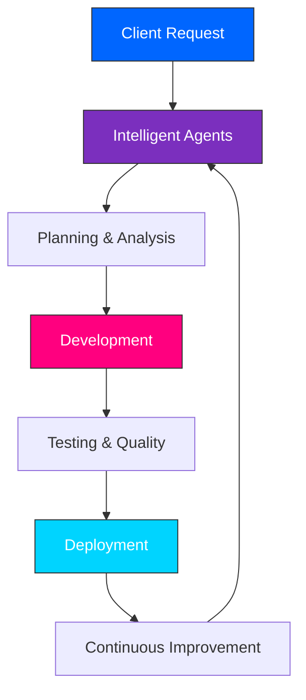

<div align="center">

# <br/>THAZIO

### Building Autonomous Digital Companies

*Premium AI Solutions • Intelligent Agents • Enterprise Automation • Product Engineering*

<p align="center">
  
  
  
  
</p>

<p align="center">
  
</p>

---

### 🌐 Website
### [thazio.com](https://bvthz5.github.io/thazio-labs/)

---

</div>

## 🧠 Who We Are

**Thazio** is a next-generation software and AI company focused on building intelligent products and delivering premium digital experiences. 

We believe the future belongs to autonomous organizations where intelligent agents collaborate, communicate, and execute complex tasks with exceptional quality.

Our mission is simple:
> **Deliver products with professionalism, innovation, and a commitment to client success.**

---

> [!IMPORTANT]
> **Research Status**: Our fully autonomous agent automation pipelines are currently in active research and development. At present, our core engineering team builds high-quality, professional software, custom AI integrations, and enterprise automation products tailored directly to our clients' unique business requirements.

---

## 👁️ Vision

At Thazio, we envision a future where companies operate with the power of AI-driven intelligence.

Imagine:
* Clients communicate naturally with AI agents.
* Intelligent systems understand requirements.
* Teams of autonomous agents coordinate tasks.
* Development workflows execute with precision.
* Quality assurance happens continuously.
* Projects are delivered efficiently with premium standards.

The result is an entirely new generation of software companies built around intelligence and automation.

---

## 🛠️ What We Do

### 💻 Product Engineering
Building modern, scalable applications tailored to business needs.

### 🤖 AI Solutions
Intelligent systems that automate workflows and enhance productivity.

### 🌐 Autonomous Agents
AI agents capable of understanding, planning, and completing tasks.

### ⚙️ Enterprise Automation
Transforming traditional operations into intelligent ecosystems.

### 🎨 Custom Development
Solutions designed around client requirements with precision and quality.

### 📈 Long-Term Support
Continuous updates and improvements for sustainable growth.

---

## 💡 Our Philosophy

*   **Client Success First** — Every solution is crafted around real business needs.
*   **Premium Quality** — We prioritize quality, security, and scalability.
*   **Professional Collaboration** — Transparent communication and reliable delivery.
*   **Continuous Innovation** — Always evolving with emerging technologies.
*   **Long-Term Relationships** — Building trust through consistent results.

---

## 🚀 Future Roadmap

We are actively building toward a fully automated company ecosystem where client requests flow seamlessly through an autonomous intelligence pipeline:



An ecosystem capable of delivering software products with speed, reliability, and exceptional quality.

---

## 💻 Tech Stack

<p align="center">
  
</p>

---

## 🚀 Quick Start (Development)

### 1. Install Dependencies
```bash
npm install
```

### 2. Run the Development Server
```bash
npm run dev
```

### 3. Open local build
Open [http://localhost:3000](http://localhost:3000) with your browser to experience the platform.

---

## 🤝 Connect With Our Team

Whether you are building:
* SaaS Platforms
* AI Products
* Enterprise Applications
* Automation Systems
* Custom Software Solutions

Our team of expert developers and AI consultants is always ready to collaborate and bring your ideas to life.

---

## 📬 Contact

*   **🌐 Website**: [thazio.com](https://bvthz5.github.io/thazio-labs/)
*   **📧 Email**: [info@thazio.com](mailto:info@thazio.com)

---

<div align="center">

### *"Engineering intelligence. Delivering excellence."*

**Founder of THAZIO**

</div>
