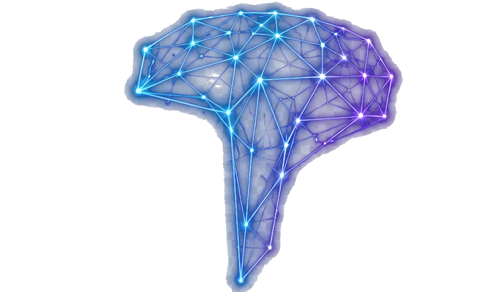

<div align="center">
  
  <h1>THAZIO</h1>
  <p><strong>The Future Neural Intelligence Platform</strong></p>

  <!-- Badges -->
  <p>
    
    
    
    
    
  </p>
</div>

---

## 🧠 Overview

**THAZIO** is a next-generation enterprise platform engineered at the intersection of **Artificial Intelligence**, **Brain-Computer Interfaces (BCI)**, and **Enterprise Automation**. 

The platform features an ultra-premium architecture boasting immersive 3D WebGL visuals, cinematic intro sequences, and fluid hardware-accelerated animations to deliver a true luxury tech experience.

## ✨ Key Features

- **Cinematic Experience:** High-performance video intro sequence with robust browser autoplay fallback logic.
- **Neural Interactivity:** Floating, pulse-animated holographic assets with custom image extraction algorithms.
- **3D Neural Core:** WebGL immersive backgrounds powered by `Three.js` and `@react-three/fiber`.
- **Buttery Smooth Scroll:** Custom `Lenis` scroll physics dynamically linked to component mounting states.
- **Enterprise-Grade UI:** Glassmorphism overlays, clean component segregation, and highly optimized rendering.

## 🚀 Quick Start

### 1. Install Dependencies
```bash
npm install
```

### 2. Run the Development Server
```bash
npm run dev
```

Open [http://localhost:3000](http://localhost:3000) with your browser to experience the platform.
